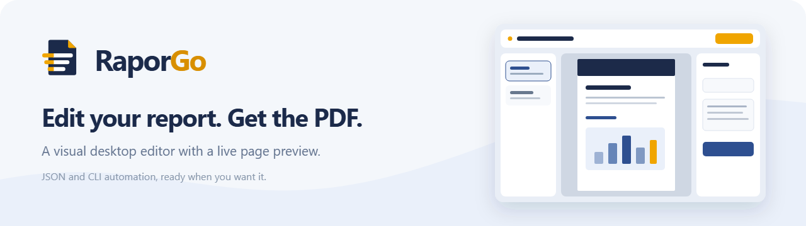
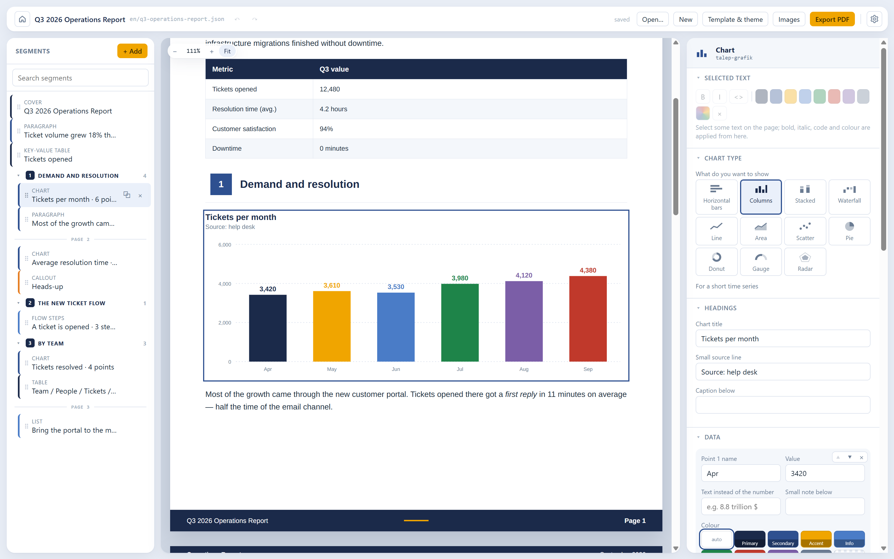
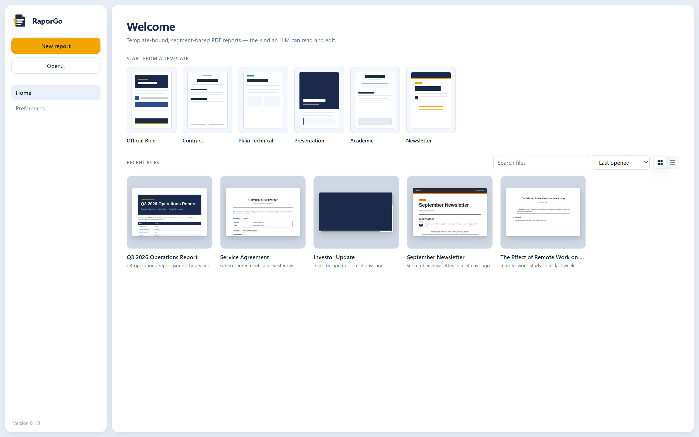
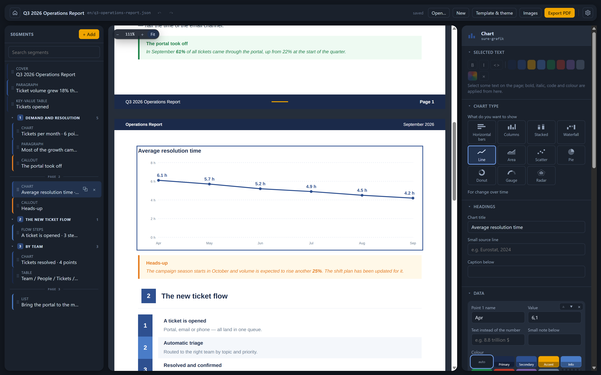
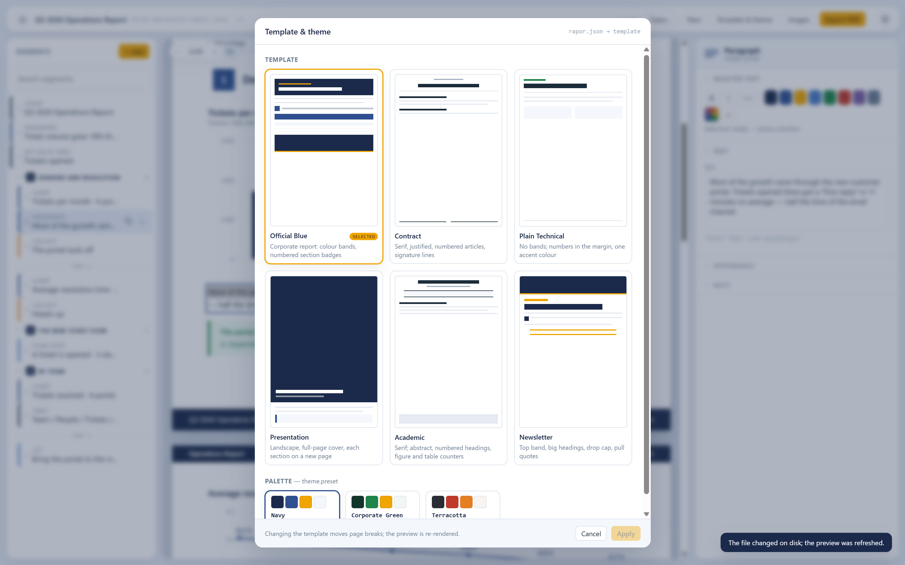
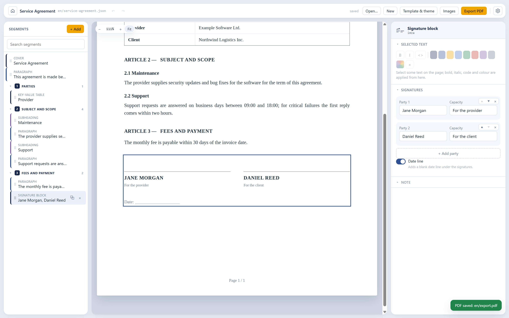
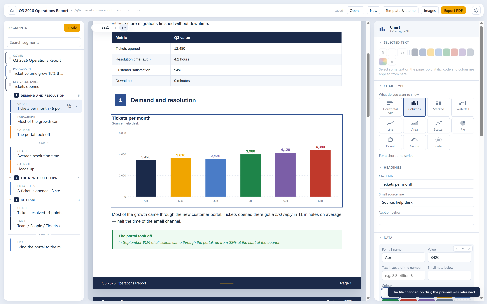
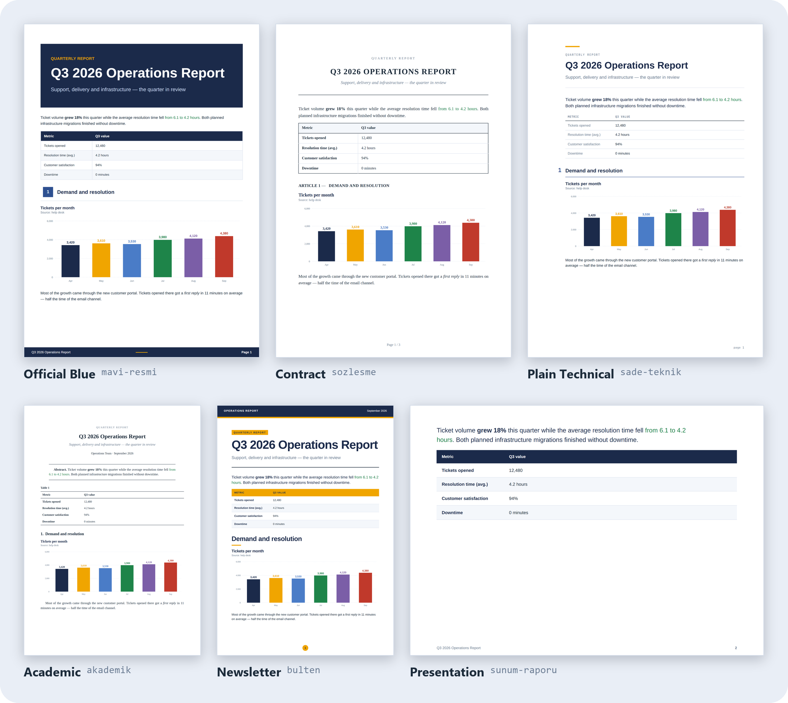

**English** · [Türkçe](README.tr.md)

# RaporGo

**Build your report in a visual editor, preview it live and export it as a PDF.** RaporGo is a
free, open-source desktop editor for reports built from templates and segments.

It works like a CV builder: pick a template, arrange segments (headings, tables, charts, flow
steps, callouts, images) and export a PDF. The difference is that a report is not state locked
inside the app. It is a plain JSON file on disk. Any tool that can run code, such as Claude Code,
Codex or Gemini CLI, can read it and edit it in one go, even while it is open in the editor.



## Download

Get the Windows installer from the [latest release](https://github.com/Pandomentall/RaporGo/releases/latest).

The installer is not code-signed yet, so Windows SmartScreen may warn you the first time. Choose
**More info → Run anyway**. You can also [build it from source](#build-from-source).

## What you get

- **What you see is the PDF.** The preview and the export share one render engine
  (HTML + CSS → Paged.js → Chromium), so the page breaks in the editor are the real page breaks.
- **Edit on the page.** Click any text in the preview to change it. Select a phrase to make it
  bold, italic, code or coloured. Everything else lives in the properties panel on the right.
- **Charts are data, not images.** Eleven chart types, drawn by the template in the document's
  font and palette, and edited by typing numbers.
- **Six templates, one file.** Switch between a corporate report, a contract, a technical note, a
  landscape deck, an academic paper and a newsletter. The segments stay the same; the page changes.
- **Ten languages.** The interface, the menus and the words a template prints (such as "Page 3"
  or "Figure 2") come in English, Turkish, Spanish, German, French, Portuguese (Brazil), Italian,
  Russian, Chinese (Simplified) and Japanese.
- **Light, dark or system theme.** The page itself stays white paper in every theme.
- **No account, no cloud.** Reports are files on your disk. Images go into an `image_Assets/`
  folder beside the report.

<p>
  
  
</p>
<p>
  
  
</p>

## Hand the JSON to your AI

Every report file starts with a short English `_llm` block. It lists the segment types and their
fields, the inline markup, the templates and the languages. The block is generated from the JSON
Schema and rewritten on every save, so it never goes stale. To have an AI edit a report, give it
the `.json` file and nothing else.

While the report is open, the editor watches the file. When an AI (or you, in a text editor)
changes it, the preview redraws at once. The editor never overwrites the new version with its old
copy.

```
you > The portal went from 22% to 61% of tickets.
      Add a callout after the growth paragraph.
ai  ● Read q3-operations-report.json
    ● Edit q3-operations-report.json  + callout "The portal took off"
```



There are three ways to work:

| | How |
|---|---|
| **By hand** | Pick a template → fill in segments → preview → export |
| **Mixed** | Build the skeleton yourself → ask an AI to "rewrite section 3" → the preview updates → polish → export |
| **Automated** | An AI builds the report from scratch with the `raporgo` CLI → open it in the editor, fix, export |

## Templates

The same report, printed with each template:



| Template | Character |
|---|---|
| `mavi-resmi` (Official Blue) | Corporate report: colour bands, numbered section badges, zebra tables |
| `sozlesme` (Contract) | Contract: serif, justified, `ARTICLE n` / `n.m` numbering, signature lines |
| `sade-teknik` (Plain Technical) | Technical note: no bands, numbers in the margin, a single accent colour |
| `sunum-raporu` (Presentation) | Deck: landscape pages, full-page cover, every section on a new page |
| `akademik` (Academic) | Paper: serif, abstract, numbered headings, figure and table counters |
| `bulten` (Newsletter) | Newsletter: top band, large headings, drop caps, pull quotes |

The palette is independent of the template: `lacivert` (navy), `yesil-kurumsal` (corporate
green) or `kiremit` (terracotta). Each template uses the palette's roles in its own way.

Fonts are **embedded in the repo** (Arimo, Tinos and JetBrains Mono, all under the OFL). System
fonts are never used, so the output is identical on every machine, in CI and wherever an AI runs
it.

## The file format

```jsonc
{
  "_llm": ["RaporGo report: the RaporGo app turns this JSON into a PDF.", "…"],
  "schemaVersion": "1.0",
  "template": "mavi-resmi",
  "meta": { "title": "Q3 2026 Operations Report", "date": "September 2026", "language": "en" },
  "segments": [
    { "id": "cover", "type": "cover" },
    { "id": "intro", "type": "paragraph", "text": "Ticket volume grew **18%** this quarter…" },
    { "id": "s1", "type": "section", "title": "Demand and resolution" },
    { "id": "tickets", "type": "chart", "chart": "column", "title": "Tickets per month",
      "data": [{ "label": "Jul", "value": 3980 }, { "label": "Aug", "value": 4120 }] }
  ]
}
```

Four rules make the format easy for an AI to work with:

1. **Every segment has a stable `id`**, so you can say "change this segment".
2. **Images are files under `image_Assets/`, not base64.** One embedded PNG would make the file
   unreadable.
3. **The JSON Schema is published** (`schema/rapor-1.0.json`), so an AI can check its own output.
4. **The file explains itself** through the `_llm` block described above.

The full contract (in Turkish) is in [docs/LLM.md](docs/LLM.md). Working examples are in
[`examples/showcase`](examples/showcase).

## Build from source

This is a **pnpm** workspace. `npm install` does not work, because the packages depend on each
other through the `workspace:*` protocol.

```bash
pnpm install
pnpm build
```

To start the desktop editor:

```bash
pnpm dev
```

To render a report from the command line: the CLI prints through Playwright's Chromium, which you
install once. The editor prints with its own Chromium and doesn't need it.

```bash
pnpm --filter @raporgo/render exec playwright install chromium
node packages/cli/dist/bin.js render examples/showcase/en/q3-operations-report.json -o report.pdf
```

The CLI also reads and edits reports segment by segment (`outline`, `get`, `set`, `insert`,
`move`, `remove`, `meta`, `theme`, `validate`). Run `node packages/cli/dist/bin.js --help` for the
list. To build the Windows installer, run `pnpm --filter @raporgo/desktop run dist`.

## Repository layout

| Package | Responsibility |
|---|---|
| `packages/core` | Document model: Zod schema, segment operations, file I/O, validation, the `_llm` guide |
| `packages/templates` | Six templates, shared segment markup, theme tokens, embedded fonts, document-language labels |
| `packages/render` | Document → HTML pipeline; PDF and layout measurement through Playwright for the CLI |
| `packages/cli` | The `raporgo` command-line interface |
| `apps/desktop` | The Electron editor |

## Tests

```bash
pnpm test
```

Besides the unit tests, a layout test renders the showcase report and compares every segment's
box on the page against a committed baseline, within 1.5 px. If you change a template on
purpose, regenerate the baseline and read the diff:

```bash
pnpm --filter @raporgo/render run baseline
```

## Contributing

Issues and pull requests are welcome. [CONTRIBUTING.md](CONTRIBUTING.md) (in Turkish) covers the
workflow, how to add a template and how the ten interface languages are kept in sync.

## License

MIT. The embedded fonts are under the SIL Open Font License; their licences are in
`assets/fonts/`.
