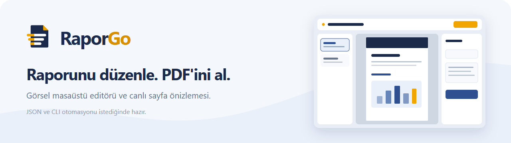

[English](README.md) · **Türkçe**

# RaporGo

**Raporunu görsel editörde hazırla, canlı önizle ve PDF olarak dışa aktar.** RaporGo, şablon ve
segmentlerle çalışan ücretsiz ve açık kaynaklı bir masaüstü rapor editörüdür.

CV oluşturucular gibi çalışır: bir şablon seç, segmentleri (başlık, tablo, grafik, akış
adımları, uyarı kutusu, görsel) düzenle, PDF al. Farkı şu: rapor uygulamanın içinde kilitli bir
state değil, diskte duran düz bir JSON dosyasıdır. Bu yüzden Claude Code, Codex ya da Gemini CLI
gibi kod çalıştırabilen bir araç raporu **tek kalemde okuyup düzenleyebilir**, sen editörde
açıkken bile.

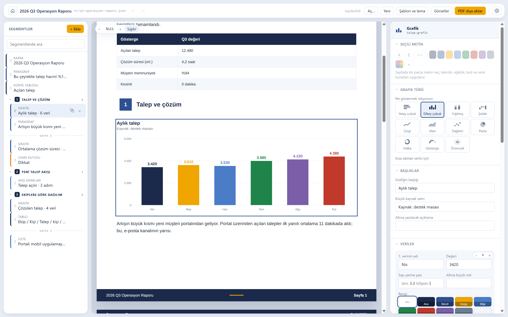

## İndir

Windows kurulum dosyası [son sürümde](https://github.com/Pandomentall/RaporGo/releases/latest).

Kurulum dosyası henüz kod imzalı değil, bu yüzden Windows SmartScreen ilk seferde uyarabilir:
**Ek bilgi → Yine de çalıştır**. Ya da [kaynaktan derle](#kaynaktan-derle).

## Neler var

- **Gördüğün sayfa PDF'in kendisi.** Önizleme ve dışa aktarma tek render motorunu paylaşır
  (HTML + CSS → Paged.js → Chromium). Editördeki sayfa kırılmaları gerçek sayfa kırılmalarıdır.
- **Sayfada düzenle.** Önizlemedeki herhangi bir metne tıklayıp değiştir. Bir ifadeyi seçip
  kalın, eğik, kod ya da renkli yap. Geri kalan her şey sağdaki özellik panelinde.
- **Grafikler görsel değil, veri.** On bir grafik tipi var. Şablon onları belgenin fontu ve
  paletiyle çizer; sen sayı girerek düzenlersin.
- **Altı şablon, tek dosya.** Kurumsal rapor, sözleşme, teknik not, yatay sunum, akademik makale
  ve bülten arasında geçiş yap. Segmentler değişmez, sayfa değişir.
- **On dil.** Arayüz, menüler ve şablonun bastığı kelimeler ("Sayfa 3", "Şekil 2" gibi) on dilde:
  Türkçe, İngilizce, İspanyolca, Almanca, Fransızca, Portekizce (Brezilya), İtalyanca, Rusça,
  Çince (basitleştirilmiş) ve Japonca.
- **Açık, koyu ya da sistem teması.** Sayfanın kendisi her temada beyaz kâğıttır.
- **Hesap yok, bulut yok.** Raporlar diskindeki dosyalardır. Görseller raporun yanındaki
  `image_Assets/` klasörüne gider.

<p>
  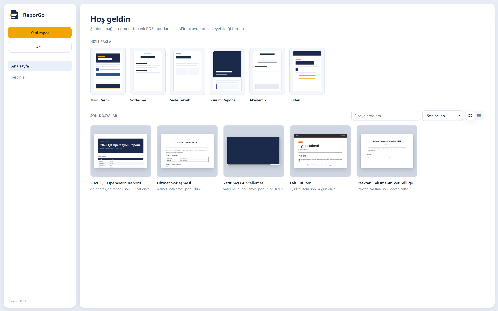
  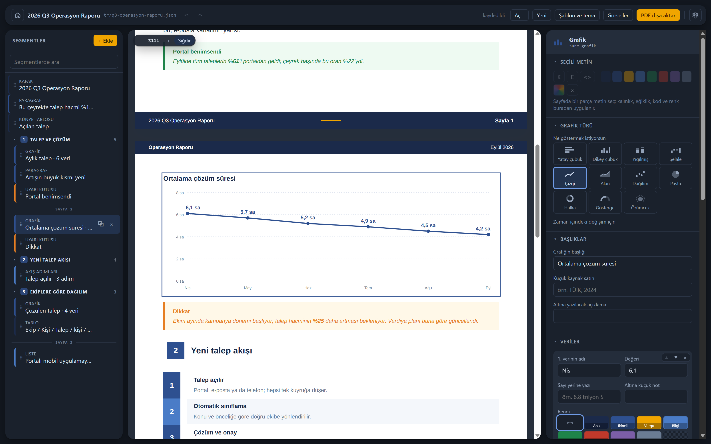
</p>
<p>
  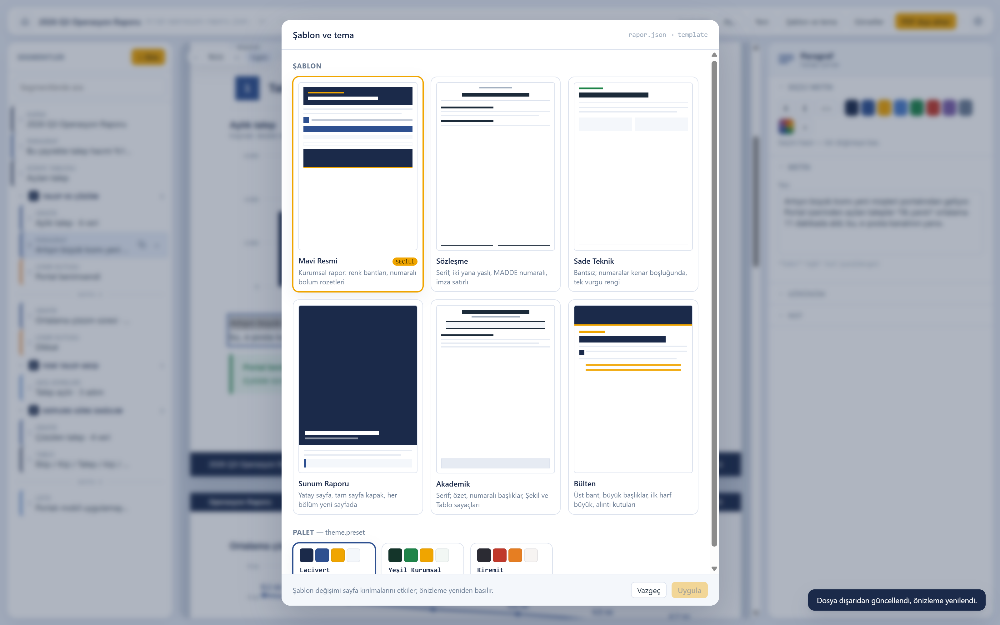
  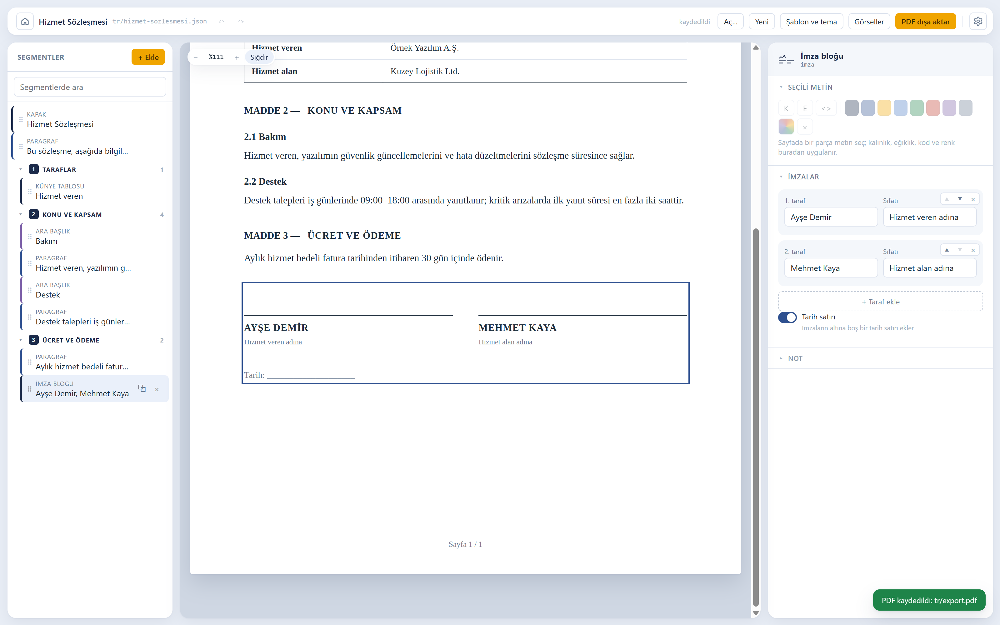
</p>

## JSON'u yapay zekâna ver

Her rapor dosyası kısa bir İngilizce `_llm` bloğuyla başlar. Blokta segment tipleri ve alanları,
satır içi işaretler, şablonlar ve diller yazar. Blok JSON Schema'dan üretilir ve her kayıtta
yeniden yazılır, yani hiç eskimez. Bir yapay zekâya raporu düzenletmek için ona yalnızca `.json`
dosyasını vermen yeter.

Rapor açıkken editör dosyayı izler. Bir yapay zekâ (ya da sen, bir metin editöründe) dosyayı
değiştirdiğinde önizleme anında yeniden çizilir. Editör yeni sürümün üstüne eski kopyasını asla
yazmaz.

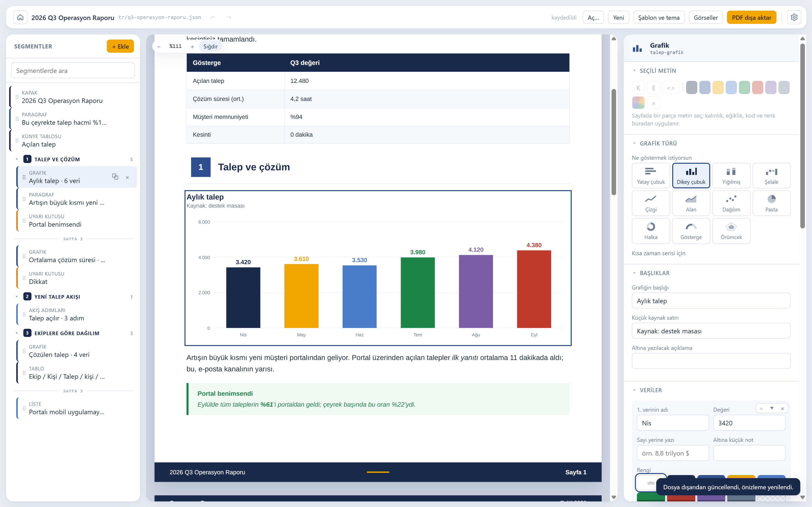

Üç çalışma biçimi var:

| | Nasıl |
|---|---|
| **Elle** | Şablon seç → segmentleri doldur → önizle → dışa aktar |
| **Karma** | İskeleti kendin kur → yapay zekâya "3. bölümü yeniden yaz" de → önizleme güncellenir → rötuşla → dışa aktar |
| **Otomatik** | Yapay zekâ raporu `raporgo` CLI ile sıfırdan kurar → editörde aç, düzelt, dışa aktar |

## Şablonlar

<p>
  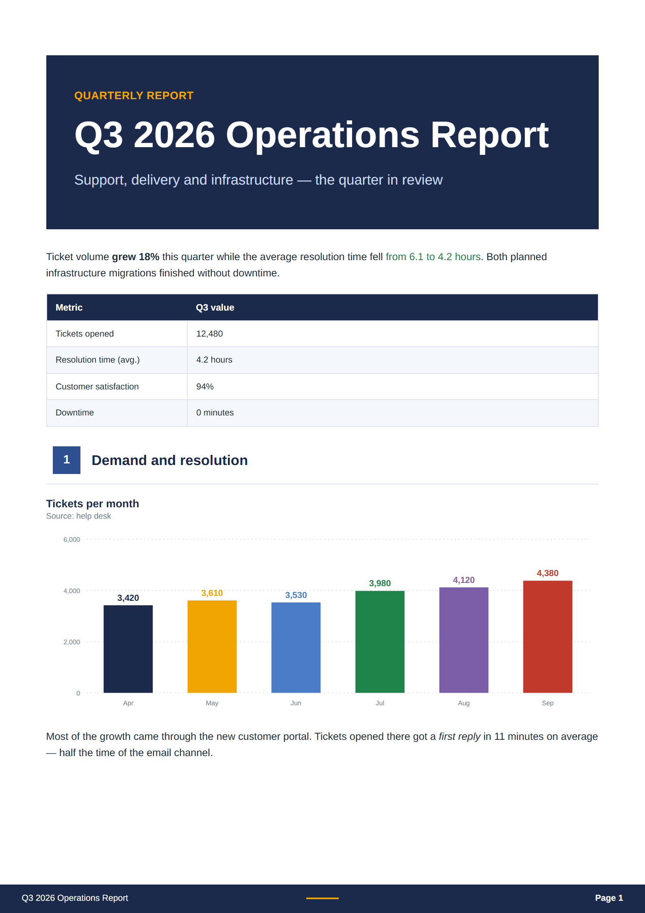
  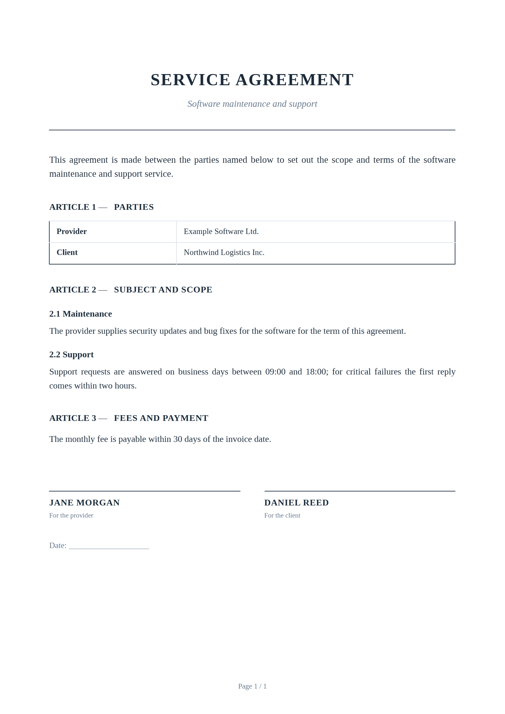
  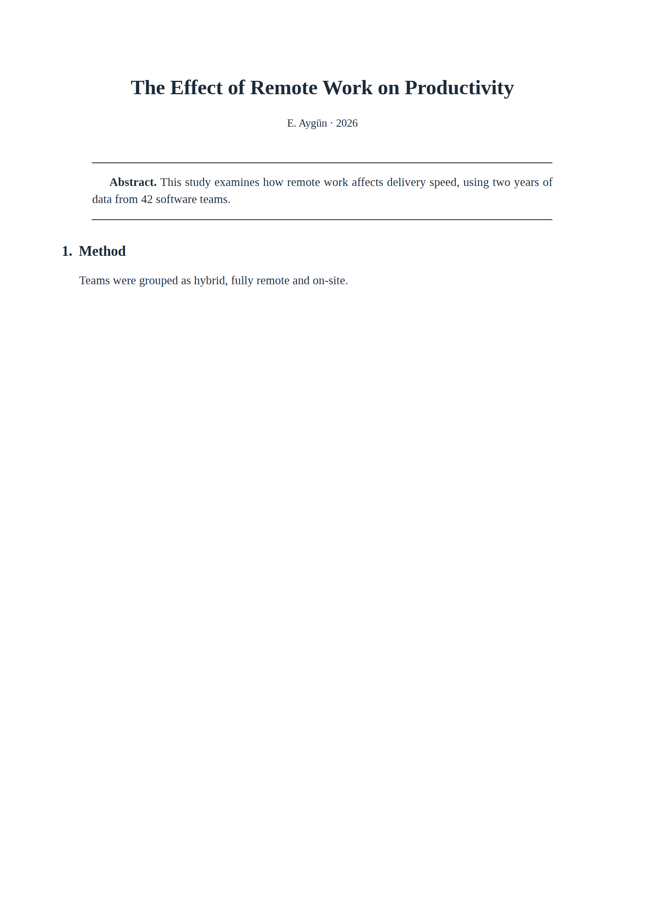
  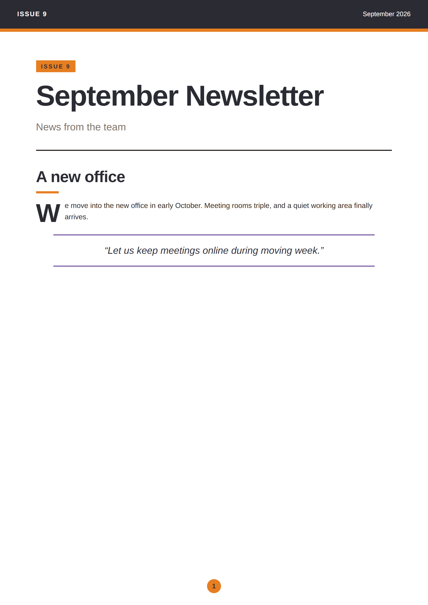
  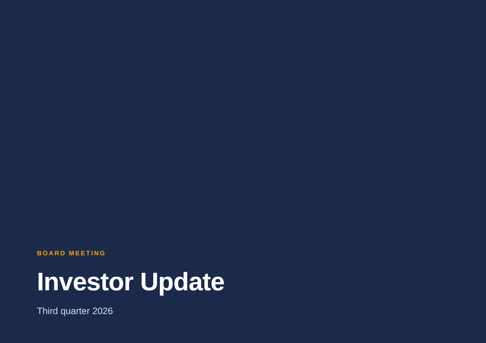
</p>

| Şablon | Karakter |
|---|---|
| `mavi-resmi` | Kurumsal rapor: renk bantları, numaralı bölüm rozetleri, zebra tablolar |
| `sozlesme` | Sözleşme: serif, iki yana yaslı, `MADDE n` / `n.m` numaralama, imza satırları |
| `sade-teknik` | Teknik not: bantsız, numaralar kenar boşluğunda, tek vurgu rengi |
| `sunum-raporu` | Sunum: yatay sayfa, tam sayfa kapak, her bölüm yeni sayfada |
| `akademik` | Makale: serif, özet, numaralı başlıklar, Şekil ve Tablo sayaçları |
| `bulten` | Bülten: üst bant, büyük başlıklar, ilk harf büyük, alıntı kutuları |

Palet şablondan bağımsızdır (`lacivert`, `yesil-kurumsal`, `kiremit`); her şablon paletin
rollerini kendi dilinde kullanır.

Fontlar **repoya gömülüdür** (Arimo, Tinos ve JetBrains Mono, üçü de OFL). Sistem fontuna hiç
bakılmaz; çıktı her makinede, CI'da ve yapay zekânın çalıştığı ortamda aynıdır.

## Belge biçimi

```jsonc
{
  "_llm": ["RaporGo report: the RaporGo app turns this JSON into a PDF. Edit it as plain JSON.", "…"],
  "schemaVersion": "1.0",
  "template": "mavi-resmi",
  "meta": { "title": "Q3 2026 Operasyon Raporu", "date": "Eylül 2026", "language": "tr" },
  "segments": [
    { "id": "cover", "type": "cover" },
    { "id": "giris", "type": "paragraph", "text": "Talep hacmi bu çeyrekte **%18** arttı…" },
    { "id": "b1", "type": "section", "title": "Talep ve çözüm" },
    { "id": "talepler", "type": "chart", "chart": "column", "title": "Aylık talep",
      "data": [{ "label": "Tem", "value": 3980 }, { "label": "Ağu", "value": 4120 }] }
  ]
}
```

Dört kural formatı yapay zekâ dostu yapıyor:

1. **Her segmentin kalıcı bir `id`'si var**, "şu segmenti değiştir" diyebilmek için.
2. **Görseller base64 değil, `image_Assets/` altında dosya.** Gömülü tek bir PNG dosyayı
   okunamaz hâle getirir.
3. **JSON Schema yayınlanıyor** (`schema/rapor-1.0.json`), yapay zekâ kendi çıktısını doğrulayabilir.
4. **Dosya kendini anlatır:** yukarıdaki `_llm` bloğu.

Tam sözleşme: [docs/LLM.md](docs/LLM.md). Çalışan örnekler: [`examples/showcase`](examples/showcase).

## Kaynaktan derle

Bu bir **pnpm** workspace'i. `npm install` çalışmaz, çünkü paketler birbirine `workspace:*`
protokolüyle bağlı.

```bash
pnpm install
pnpm build
```

Masaüstü editörünü aç:

```bash
pnpm dev
```

Ya da komut satırından bir rapor bas. CLI, Playwright'ın Chromium'uyla basar; onu bir kez
kurman gerekir. Editör kendi Chromium'uyla bastığı için ona gerekmez.

```bash
pnpm --filter @raporgo/render exec playwright install chromium
node packages/cli/dist/bin.js render examples/showcase/tr/q3-operasyon-raporu.json -o rapor.pdf
```

CLI raporları segment segment de okur ve düzenler (`outline`, `get`, `set`, `insert`, `move`,
`remove`, `meta`, `theme`, `validate`). Liste için `node packages/cli/dist/bin.js --help`.
Windows kurulum dosyası için: `pnpm --filter @raporgo/desktop run dist`.

## Depo yapısı

| Paket | Sorumluluk |
|---|---|
| `packages/core` | Doküman modeli: Zod şeması, segment işlemleri, dosya G/Ç, doğrulama, `_llm` rehberi |
| `packages/templates` | Altı şablon, ortak segment markup'ı, tema token'ları, gömülü fontlar, belge dili etiketleri |
| `packages/render` | Doküman → HTML hattı; CLI için Playwright ile PDF ve yerleşim ölçümü |
| `packages/cli` | `raporgo` komut satırı arayüzü |
| `apps/desktop` | Electron editörü |

## Testler

```bash
pnpm test
```

Birim testlerinin yanında bir yerleşim testi, showcase raporunu basar ve her segmentin sayfadaki
kutusunu kayıtlı bir taban çizgisiyle 1.5 px toleransla karşılaştırır. Bir şablonu bilerek
değiştirdiğinde taban çizgisini yenile ve diff'i oku:

```bash
pnpm --filter @raporgo/render run baseline
```

## Katkı

Issue ve pull request'ler açık. Çalışma düzeni, şablon ekleme ve on arayüz dilinin nasıl
senkron tutulduğu [CONTRIBUTING.md](CONTRIBUTING.md)'de.

## Lisans

MIT. Gömülü fontlar SIL Open Font License altındadır; lisansları `assets/fonts/` içindedir.
